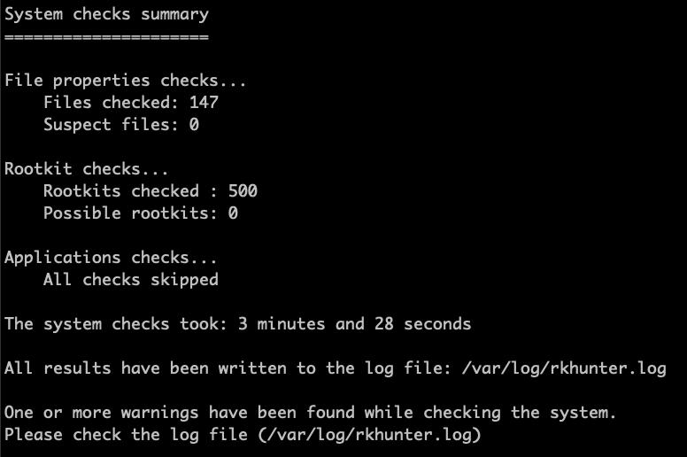

Basic Security Check on Debian/ubuntu
===


## Table of Contents

[TOC]

## Basic Check and do limit ssh login

Step.1 Check login records

```gherkin=
last
```

Step.2 Do limit for ssh login
```gherkin=
vim /etc/hosts.allow

--- /etc/hosts.allow ---
sshd: 202.39.9.79/32
--- /etc/hosts.allow ---
```

```gherkin=
vim /etc/hosts.deny

--- /etc/hosts.deny ---
sshd:ALL
--- /etc/hosts.deny ---
```

Step.3 Do command history record into syslog
```gherkin=
vim /etc/bash.bashrc

--- /etc/bash.bashrc ---
PROMPT_COMMAND='history -a; { command=$(history 1 | { read x y; echo $y; }); [ "$SSH_CLIENT" ] || SSH_CLIENT=$SUDO_USER; [ "$SSH_CLIENT" ] || SSH_CLIENT='sudo'; logger -p local0.notice -t history -i "date=$(date +%Y\/%m\/%d\-%T), user=$USER, from=$SSH_CLIENT, pwd=$PWD, command=$command"; }'
--- /etc/bash.bashrc ---
```

Step.4 Check for guid=0
```gherkin=
awk -F':' '{print "user:"$1"\tgid:"$3}' /etc/passwd
```

Step.5 disable root login with password
```gherkin=
echo 'PermitRootLogin prohibit-password' >> /etc/ssh/sshd_config
grep --color '^PermitRootLogin' /etc/ssh/sshd_config
/etc/init.d/ssh restart
```

## Check for startup

Please ensure if it have any new or odd file(s)?

```gherkin=
ls -lta /etc/init.d/
ls -lta /etc/cron.d/
ls -lta /etc/systemd/system/

find /etc/init.d/ -type f -ctime -30
find /etc/cron.d/ -type f -ctime -30
find /etc/systemd/ -type f -ctime -30
```

## Verify the package that if it have be modified?

Please ensure the output from the two command.
```gherkin=
apt-get -y install debsums
debsums -c
debsums -ca
```

## Do basic rootkit scan with the well-know tools.(rkhunter,chkrootkit)

Step.1 Install and basic configuration tunning
```gherkin=
aptitude -y install rkhunter chkrootkit

sed -i 's|UPDATE_MIRRORS=0|UPDATE_MIRRORS=1|g' /etc/rkhunter.conf
sed -i 's|MIRRORS_MODE=1|MIRRORS_MODE=0|g' /etc/rkhunter.conf
sed -i 's|WEB_CMD="/bin/false"|WEB_CMD=""|g' /etc/rkhunter.conf
egrep --color '^UPDATE_MIRRORS|^MIRRORS_MODE|^WEB_CMD' /etc/rkhunter.conf
```


Step.2 Update and Scan with rkhunter
```gherkin=
rkhunter --update
rkhunter -c
```




Step.3 Scan with chkrootkit
Please ensure the output after checking about network/execute/networking interface mode/login record.
```gherkin=
chkrootkit -x
```


## Scan with unhide

Step.1 Install unhide
```gherkin=
aptitude -y install unhide
```

Step.2 Scan with the following commands
```gherkin=
unhide brute
unhide procall
unhide sys
unhide-tcp
```

# --- END --- #
